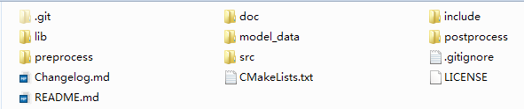
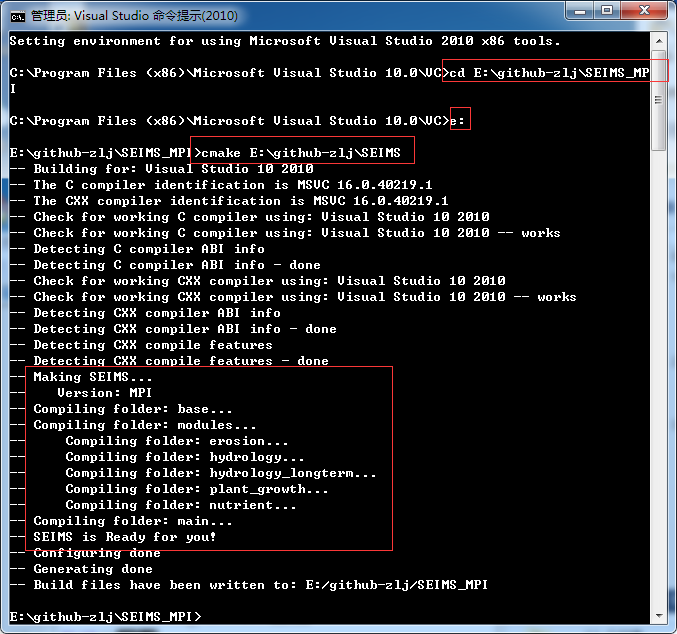
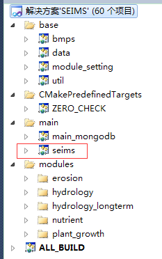
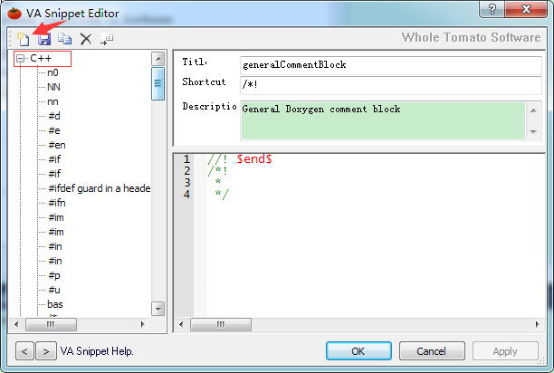
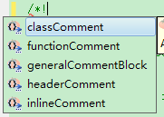

# Manual for Developers in Chinese v1.0
==========

prepared by Liangjun Zhu （zlj@lreis.ac.cn）

----------

# 目录
[**前言**](#前言)

[**Github使用说明**](#github使用说明)

1. [Windows下安装Git](#windows下安装git)

2. [从Github中克隆代码库](#从github中克隆代码库)

3. [代码同步与更新](#代码同步与更新)

[**SEIMS源码编译**](#seims源码编译)

1. [源码结构](#源码结构)

2. [Windows下VS编译](#windows下vs编译)

3. [Linux下GNU编译](#linux下gnu编译)

[**运行SEIMS**](#运行seims)

1. [mongoDB](#mongodb)

2. [模型配置文件](#模型配置文件)

3. [运行命令](#运行命令)

[**SEIMS基本框架**](#seims基本框架)

1. [模型运行流程](#模型运行流程)

[**SEIMS模块编写流程**](#seims模块编写流程)

[**编码规范**](#编码规范)

1. [doxygen注释规则](#doxygen注释规则)

[可能需要用的的软件](http://pan.baidu.com/s/1bng29AJ)
# 前言
-----------
SEIMS（Spatially Explicit Integrated Modeling System）模型是由刘军志等人开发的以栅格为基本模拟单元、能体现水流空间运动的全分布式水文模型。SEIMS在借鉴Wetspa、LISEM、CASC2D、DHSVM和流溪河模型等多个模型基础上开发的模块化水文模型，采用C++编写，实现了子流域-基本单元的双层并行，采用的并行策略为共享内存（OpenMP）和消息传递（MPI），并利用NoSql数据库MongoDB进行数据组织管理。模型可在Windows及Linux平台下运行。

目前，模型还不完善，主要存在以下主要问题：

1. 生态和养分循环模块还很初步，距实用还相差很远；
2. 水文和侵蚀模块虽相对成熟，但尚缺乏进一步的验证工作。

因此需要大家群策群力完善模型，主要有以下几个目标：

1. 每个模块都具有完善的理论和开发文档，添加符合doxygen规范的代码注释；
2. 编码规范（包括模块和变量命名，编程习惯等），空闲了可以多看看Google C++ Code Style（[EN](http://google-styleguide.googlecode.com/svn/trunk/cppguide.html)，[CN](http://www.cnblogs.com/ggjucheng/archive/2012/01/02/2310278.html)）；
3. 编写模块需要与当前主流的其他模型进行对比验证，多做测试；
4. 为用户提供易用的Web界面，用户可选择在服务器端运行模型，也可以选择把模型和数据下载到本机运行。

# Github使用说明
为了便于模型开发的多人协作，计划采用Github平台进行版本控制。关于Git的详细教程，推荐阅读[廖学峰的网站](http://www.liaoxuefeng.com/wiki/0013739516305929606dd18361248578c67b8067c8c017b000/)这一节主要介绍我们需要用到的一些命令操作。快速记忆一些[常用的Git命令](http://www.codeceo.com/article/git-command-guide.html)吧！
[返回目录](#目录)
## Windows下安装Git
[msysgit](http://msysgit.github.io/)是windows版的Git，直接下载安装即可，安装完成后，打开“开始”菜单，找到Git->Git Bash，出现一个类似命令行的窗口，说明Git安装成功了。
安装完成后，在git bash 命令行里输入：

~~~
$ git config --global user.name "Your Name"
$ git config --global user.email "email@example.com"
~~~

这两行表示，这台机器上的所有Git仓库都使用这个配置。当然，你也可以为不同的仓库配置不同的用户名，详情请参阅相关文档。

[返回目录](#目录)
## 从Github中克隆代码库
配置好本地的Git环境之后，我们需要将代码库从Github上克隆到本地计算机。
+ 首先在Github.com上注册一个账号。注册好之后，需要设置SSH key，在`git bash`中输入：
~~~
ssh-keygen -t rsa -C youremail@example.com
~~~

一路回车，如果顺利的话，在用户目录里能找到`.ssh`目录，里面有`id_rsa`和`id_rsa.pub`两个文件，这两个就是SSH Key的密钥对，前者是私钥，后者是公钥。
+ 然后，登录Github，打开 Account Settings，SSH key页面，点Add SSH Key，Title任意填，在Key文本框里填上`id_rsa.pub`的内容，点击Add key就好啦。
+ 打开SEIMS模型的首页https://github.com/seims/SEIMS， 点击`Fork`，来创建自己账户下的SEIMS克隆，克隆结束之后，复制克隆库的SSH地址，这样它会自动使用你自己的SSH密钥，而不用每次在`git pull`或者`push`时询问你的用户名和密码。下一步，我们将克隆一份代码库到本地计算机。
~~~
cd <destination folder>
git clone git@github.com:<yourname>/SEIMS.git
~~~

+ 切换到克隆目录，在这里可以添加上游远程仓库：
~~~
git remote add upstream git@github.com:seims/SEIMS.git
~~~
+ 这样，我们就将SEIMS代码克隆到了本地计算机一份。接下来，我们尝试对本地SEIMS文件做一下修改，然后提交到远程库（你自己的），最后通过`pull request` 提交给SEIMS代码拥有者。

为了说明问题，我简单修改了一下README文件，然后 `git status`  查看本地和远程的差别
随后
~~~
Git add README.md
Git commit –m "modification test”
Git push –u origin master
~~~

这样就把本地的本次修改提交到了远程库中。

+ 在我的github目录下可以看到刚才提交的修改，这时候，如果想把这个修改，提交到`seims/SEIMS`，需要点击`pull request`按钮,然后点击`Create pull request`， 便把本次修改提交完成了。而SEIMS拥有者就会收到新的`pull request`并处理了。

[返回目录](#目录)
## 代码同步与更新
以上我们知道了如何将本地的修改提交到源代码库，接下来，看看如何将源代码库中的更新同步到本地库中。

比如我在`seims/SEIMS`下修改了README.md文件，现在同步到本地。
+ 查看远程主机地址
~~~
git remote -v
~~~
经过以上的设置，正常情况应该看到类似结果,如果没有upstream则需添加上游远程库

+ 将源代码库更新的内容同步到本地，检查差异，然后再和本机分支合并
~~~
git fetch upstream
git checkout master
git merge upstream/master
~~~
+ 多数情况下，git可以自动合并，如果出现冲突，则需手动处理后，再`commit`提交，冲突结果类似：

[返回目录](#目录)

# SEIMS源码编译
这部分介绍如何在不同平台下编译安装SEIMS。

## 源码结构

根目录如上图所示，其中:
~~~
.git Github版本管理的一些文件，勿动
doc  存放模型开发文档（doxygen自动生成）
include和lib为外部依赖库的文件，勿改动
model_data为测试数据，使用时应复制到他处
src为SEIMS源码
preprocess为预处理程序源码
postprocess为后处理程序源码
.gitignore为github管理时忽略的文件后缀名
Changelog.md为版本更新日志
CMakeLists.txt为CMake命令文件，跨平台编译源码
LICENSE为GNU LICENSE
READEME.md为模型介绍
~~~
`src`内有3个文件夹，`base`为模型基本模块组，`modules`为功能模块组，`main`为主程序入口模块组。

`modules`中包含了SEIMS功能模块组：`hydrology`和`Hydrology_longterm`为水文模块组，`erosion`为侵蚀模块组，`nutrient`为养分循环模块组，`growth`为植被生长模块组。
每个模块组下又包括不同的算法模块。

[返回目录](#目录)
## Windows下VS编译
+ 安装好Microsoft Visual Studio 2010以及[Microsoft HPC Pack 2012 MS-MPI](http://www.microsoft.com/en-us/download/details.aspx?id=36045)（即MPICH2的Microsoft实现版本）、[cmake-3.2.2](http://www.cmake.org/files/v3.2/cmake-3.2.3-win32-x86.exe)
+ “开始”->Microsoft Visual Studio 2010->Visual Studio Tools->Visual Studio 命令提示(2010)，以管理员方式运行；
+ 在源码外，新建一个文件夹用于存放编译出的VS工程，比如我的是E:\github-zlj\SEIMS_VS  
~~~
cd E:\github-zlj\SEIMS_MPI
e:
~~~  
+ 打开根目录下的CMakeLists.txt，如果想生成`OpenMP`的版本，则把
~~~
SET(SEIMS_VERSION "MPI")
~~~
注释掉，反之亦然，然后：
~~~
cmake <source path>
我的是cmake E:\github-zlj\SIMS
~~~
+ cmake会自动生成sln项目文件，随后打开SEIMS.sln。命令行界面如下（左），VS解决方案如下（右）。

+ 按F6生成解决方案，在`Debug`或`Release`下可以看到一系列`lib`、`dll`库以及`seims_omp.exe`或`seims.exe`可执行文件。
 
+ 至此，由源码到VS工程的转换已经完成。在此基础上对代码所做的修改都是对<source path>内源文件的修改。

[返回目录](#目录)
## Linux下GNU编译
TODO: `CMakelist.txt`还未适配`Linux`

[返回目录](#目录)
# 运行SEIMS
SEIMS的运行分为两个版本：`OpenMP`和`MPI`
源码库中`model_data`中存放的为示例数据，建议将此文件夹拷到本机的其他位置，再运行模型。

[返回目录](#目录)
## mongoDB
运行模型需要两个数据库源：气象数据库和参数数据库。
1. 气象数据库：一个存放有降水和气象数据的`mongodb`数据库
2. 参数数据库
一个以模型名称命名的mongodb数据库，包括下面几个表：
+ parameters：包含模型的各个输入参数的信息，可以通过调整Impact参数进行调参
+ reaches：河道相关信息
+ SiteList：模拟所需的降水和气象站点
+ Spatial：模拟所需的栅格数据、插值权重数据等，以`GridFS`方式存储
数据库的准备由预处理程序完成。

[返回目录](#目录)
## 模型配置文件
在每个模型的文件夹下包含三个主要的文件：

+ `config.fig`：包括模型运行所需的模块信息。模型运行时会按照顺序依次加载该文件中指定的各个模块（每行的最后一个以‘|’分隔的字符串），并顺序执行。

通用格式为：
~~~
No. | SettingString | | ModuleName
i.e.
0 | TimeSeries_P | | TSD_RD
if this, the corresponding module name should be TSD_RD_P so that the module name is unique.
~~~
+ `file.in`：包括模型运行的:
  + MODE（`Daily`指定模型做日尺度的模拟；`Storm`指定模型做次降水的模拟）；
  + Interval（步长，如果为Daily模拟，步长默认为1天，不可修改；如果为Storm模拟，步长单位为秒，可以分别指定坡面过程和河道过程的模拟步长，如“60, 60”指定次降水模拟的坡面和河道过程步长都是60s）；
  + 模拟开始时间（格式：YYYY-MM-DD HH:MM:SS）
  + 模拟结束时间
+ `file.out`：指定模拟的输出，格式示例如下：
  + OUTPUTID|T_PET
  + SITECOUNT|1
  + SITEID|53399
  + STARTTIME|2009-12-30 00:00:00
  + ENDTIME|2010-12-31 00:00:00
  + FILENAME|T_PET_1.asc
~~~
可选标签有：
OUTPUTID: 输出变量名
INTERVAL: INTERVAL is used only for the PET_TS output
SITECOUNT: is used only for the time series output for sites
SITENAME:
SITEID: 
REACHNAME: 
COUNT: 
TYPE: 整合类型->
   enum AggregationType
   {
	  AT_Unknown = 0,  ///< unknown
	  AT_Sum = 1,      ///< sum
	  AT_Average = 2,  ///< ave
	  AT_Minimum = 3,  ///< min
	  AT_Maximum = 4,  ///< max
	  AT_SpecificCells = 5 ///< output values of specific cells
   };
DATA_TYPE: 
WEIGHT: 
VERTICALINTERPOLATION: 
SUBBASINCOUNT:  is used only for the time series output for subbasins
SUBBASINID: 
RESERVOIRCOUNT: 
RESERVOIRID: 
STARTTIME: 开始时间
ENDTIME: 结束时间
FILENAME: 指定输出文件名及扩展名，如变量为Raster类型，则输出（.tif）文件
~~~

 + 如果输出变量为"QOUTLET"、"QTotal"、"SEDOUTLET"、"DissovePOutlet"、"AmmoniumOutlet"、"NitrateOutlet"，则需要有STARTTIME、ENDTIME、FILENAME

[返回目录](#目录)
## 运行命令
+ OpenMP调用格式为：
~~~
seims_omp <ModelPath> <threadsNum> [<layeringMethod> <IP> <port>]

<ModelPath> is the path of the configuration of the Model.
<threadsNum> must be greater or equal than 1.
<layeringMethod> 0 and 1, which means UP_DOWN and DOWN_UP respectively.
<IP> is the address of mongodb database, and <port> is its port number.
~~~
ModelPath的文件夹名称需与mongodb中数据库名称对应，且文件夹内需包含`config.fig`、`file.in`、`file.out`。其中`config.fig`指定模型的算法选择，`file.in`指定模型模拟尺度和模拟时段，`file.out`指定模型输出。
+ MPI调用格式为：
~~~
mpiexec –n 6 seims <parallel.config file>
-n 指定并行计算的核数
<parallel.config file> 为配置文件，包含
	ModelName，ProjectPath，ModulePath，DBHost，DBPort，TreadNumber，LayeringMethod
~~~
与OpenMP版本一样，ProjectPath内也需有`config.fig`、`file.in`、`file.out`。

[返回目录](#目录)
# SEIMS基本框架
在SEIMS模型中，每个子过程模拟方法对应一个独立的模块，并以动态链接库的形式存在（Windows 系统中的`DLL`文件，Linux系统中的`so`文件）。多个子过程模块构成子过程模块库，在应用时可以从模块库中选择一系列相互配合的子过程模块以动态组合运行的方式完成水文模拟任务。为了保证各个模块具有相同的接口，SEIMS模型中定义了一个模拟功能的父类[`SimulationModule`](../src/base/util/SimulationModule.h)，所有模块中都必须包含一个继承该父类的子类，并实现相应的接口函数（见下表）。

接口函数 | 功能
-------- | -------
MetadataInformation | 获取模块输入输出的元数据
SetDate | 设置时间
SetValue | 设置数值类型的输入
Set1DData | 设置一维数组类型的输入
Set2DData | 设置二维数组类型的输入
Set3DData | 设置三维数组类型的输入
GetValue | 获取数值类型的输出
Get1DData | 获取一维数组类型的输出
Get2DData | 获取二维数组类型的输出
Get3DData | 获取三维数组类型的输出
Execute |执行模块功能

模块中包含的接口函数可分为三类：

+ 元数据获取函数

`MetadataInformation`函数负责为主程序提供模块的输入输出等元数据信息。模块的元数据信息采用`XML（eXtensible Markup Language）`文档表达，包括如下几部分：
  + 模块的基本信息：包括模块 ID、列表、作者、描述、版本等；
  + 来源于水文数据库的静态输入信息：包括各个输入参数的 ID、类型、单 位、描述、来源数据库名称等；
  + 来源于其他模型输出结果的动态输入信息：包括各个输入参数的 ID、类 型、单位、描述等；
  + 模型的输出信息：包括各个输出参数的 ID、类型、单位、描述等。 

+ 数据设置与获取函数
  + 模块接口中的 `SetValue` 和 `SetXDData` 系列函数负责设置模块所需参数，而`GetValue` 和 `GetXDData` 系列函数负责获取模型的计算结果。模块中的变量类型包括时间、单个值、一维数组、二维数组和三维数组。为提高数据传递效率，数组类型的变量通过指针的方式进行数据传递，即不同模块中的同一个变量的指针指向内存中的同一块区域。
+ 模拟功能的执行函数
  + `Execution`函数执行一个时间步长的模拟功能，而其时间循环由主程序控制。

[返回目录](#目录)
## 模型运行流程
在子过程模块库的基础上，SEIMS模型的主程序（main模块）负责对一系列模块进行动态组合构建水文模拟工作流完成模拟任务，其总体运行流程如下：

+ 模型初始化
  + 首先读取配置文件中参与模拟的模块列表、模拟时段及步长等信息；
  + 根据配置信息动态加载所需模块并调用 `MetadataInformation`函数获取XML格式的元数据；
  + 解析元数据信息构建模块之间的输入输出关系，对模块进行动态组合构建水文模拟工作流；
  + 从数据库读取模拟所需数据，并调用各模块的相应接口函数为模块的输入变量赋值。

+ 水文模拟工作流的运行

水文模拟工作流的运行包括一个时间循环，在每个时间步长按照初始化阶段构建的水文模拟工作流一次运行各模块即可。运行时需要在每个时间步长开始时更新降水、气温等驱动因子的输入。如果参与计算的模块时间步长不一致，需要在运行时调整各模块的运行次数。对于存在数据依赖关系且时间步长不一致的模块，需要对其输入输出进行调整。

+ 输出模拟结果,输出配置文件中指定的模拟结果。

[返回目录](#目录)
# SEIMS模块编写流程
模块编写的一般步骤：

+ 阅读相关文献和模型文档，编写模型文档的理论部分；
+ 根据模型的相关理论，参考已有成熟模型的代码，列出模型的输入（包括以其他模块的输出作为输入）、输出，编写元数据函数(`MetadataInformation`)代码
+ 在头文件中定义所需变量，并做初始化、赋值和有效性检查的工作
+ 初始化：构造函数末尾, `initalOutputs`(为本模块的输出变量开辟内存空间，并注意在析构函数中删除所开辟的空间)
+ 赋值：`SetValue`, `Set1DData`, `Set2DData`
+ 有效性检查：`CheckInputData`
+ 根据公式，编写`Execute`函数的代码，实现模拟功能
+ 编写输出代码，`Get1DData`，`Get2DData`等

[返回目录](#目录)
# 编码规范
为了使模型代码具有更好的可读性、传承性，我们使用[doxygen](http://www.doxygen.nl/)规则对代码进行注释。
下面介绍如何在VS2010中借助VAssistX进行快速添加注释。

[返回目录](#目录)
## doxygen注释规则
装VAssistX之后，便可以在菜单栏里看到VAssistX选项了。

依次打开VAssistX -> Visual Assist X Options -> Edit VA Snippets，如图：

现在我们需要添加一些符合doxygen规则的C++注释模板，为了方便起见，快捷键Shortcut统一设置为`/*!`，这样，当需要输入注释模板时，输入`/*!`后便会出现只能提示，如下图，选择合适的便可快速插入。

+ 最基本的注释，对任何对象（`file`，`function`，`class`…）均适用，使用格式如下
~~~
//! Brief description, can span only 1 line
/*!
 * More detailed description.
 * Feel free to span as many lines
 * as you wish... All allowed.
 */
~~~
在VA中设置如下（`Title`，`Description`可以按照自己想法设置，下面均不再重复）：
~~~
Title: generalCommentBlock
Shortcut: /*!
Descrition: General Doxygen Commen Block
Code:
//! $end$
/*!
 * \ingroup 
 *
 */
~~~

+ doxygen有三种机制用于将文档分组。`module`,`member groups`, `subpaging`. 我们将采用`module`方式，首先需要用`\defgroup`标签定义一个`module`，注意**只能定义一次**，然后在添加其他对象（类、函数、变量、枚举、宏定义、`typedef`等）注释的时候用`\ingroup`标签将其纳入`module`：
~~~
/*!
 * \defgroup Base
 * Base classes and functions of SEIMS 
 */
~~~
在VA中设置
~~~
/** \defgroup
 * \brief
 *
 *
 *
 */
~~~

+ 对于一些变量或函数的定义，希望在一行内对其注释，使用格式如下：
~~~
void function1();    //!< Correct
void function2(int i);    //!< WRONG! Comment on parameter i, but function not documented!
 
//! Some other function.
void function3(int i);    //!< Some int. Correct - both function and parameter documented
~~~
上面的例子说明，对于含有参数的函数定义，不能用`in-line comment`的方式。VA中的设置如下：
~~~
//!<
~~~
+ 在*.h, *.cpp文件头部的注释,使用格式：
~~~
/*!
 * \file [filename]
 * \brief
 *
 *
 *
 * \author [your name]
 * \date
 *
 * [your comment here]
 */
~~~
在VA中设置：
~~~
/*!
 * \ingroup
 * \file $FILE_BASE$.$FILE_EXT$
 * \brief
 *
 *
 *
 * \author [your name]
 * \version 
 * \date $MONTHLONGNAME$ $YEAR$
 *
 * $end$
 */
~~~

+ 类定义的注释
~~~
/*!
 * \ingroup <group label>
 * \class [class name]
 *
 * \brief [brief description]
 *
 * [detailed description]
 *
 * \author [your name]
 * \date
 */
~~~
VA中的设置：
~~~
/*!
 * \ingroup
 * \class $end$
 *
 * \brief
 *
 *
 *
 * \author [your name]
 * \date $MONTHLONGNAME$ $YEAR$
 */
~~~
+ 函数注释块
~~~
/*!
 * \ingroup <group label>
 * \brief [brief description]
 *
 * [detailed description]
 *
 * \param[in] [name of input parameter] [its description]
 * \param[out] [name of output parameter] [its description]
 * \return [information about return value]
 * \sa [see also section]
 * \note [any note about the function you might have]
 * \warning [any warning if necessary]
 */
~~~
VA中设置：
~~~
/*!
 * \ingroup
 * \brief
 *
 * $end$
 *
 * \param[in]
 * \param[out]
 * \return
 * \sa
 * \note
 * \warning
 */
~~~
+ 数学公式的输入, 采用[MATHJAX](http://www.mathjax.org/)规则
~~~
\f$, \f$ … though the same, have to come in pair; inserts an in-text (LaTeX) formula; e.g. \f$\sqrt{(x_2-x_1)^2+(y_2-y_1)^2}\f$
\f[, \f] … inserts a long (LaTeX) formula that is displayed centered on a separate line
~~~

+ 其他一些有用的标签
~~~
\attention … paragraph where a message that needs attention may be entered
\author … paragraph where one or more author names may be entered
\brief … paragraph that serves as a brief description
\bug … paragraph where one or more bugs may be reported
\date … paragraph where one or more dates may be entered
\deprecated … paragraph indicating that this documentation block belongs to a deprecated entity
\exception <exception-object> or \throw <exception-object> … exception description for an exception object with name <exception-object>, followed by a description of the exception
\invariant … paragraph where the invariant of an entity can be described
\note … paragraph where a note can be entered
\par [(paragraph title)] … if a paragraph title is given this command starts a paragraph with a user defined heading
\param <parameter-name> … parameter description for a function parameter with name <parameter-name>; multiple adjacent \param commands will be joined into a single paragraph; direction of the attribute may be specified:
e.g.
  \param[in] param1 Description
  \param[out] param1 Description
  \param[in,out] param1 Description
\remarks … paragraph where one or more remarks may be entered
\return … return value description for a function
\retval <return value> … return value description for a function with name <return value>
\sa or \see … paragraph where one or more cross-references to classes, functions, methods, variables, files or URL may be specified; two names joined by either :: or # are understood as referring to a class and one of its members; one of several overloaded methods or constructors may be selected by including a parenthesized list of argument types after the method name
\since … used to specify since when (version or time) an entity is available
\test … paragraph where a test case can be described
\todo … paragraph where a TODO item is described
\version … paragraph where one or more version strings may be entered
\warning … paragraph where one or more warning messages may be entered
~~~

[返回目录](#目录)