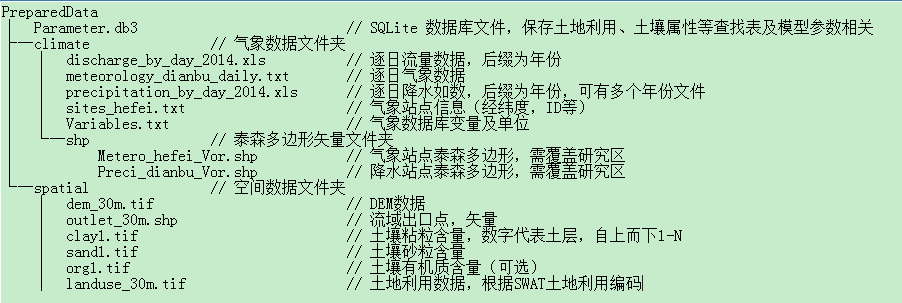
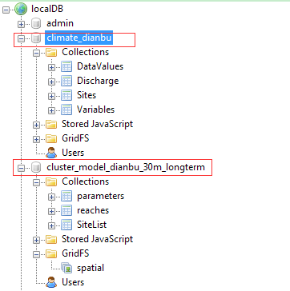

# Proprocessing for SEIMS
--------
prepared by Liangjun Zhu

2015/6/20
## 1 Prepared Data
像所有的水文模型一样，我们的准备数据有气象、水文、空间数据等，下图先入为主，展示了输入数据的文件结构。

**图1 模型数据准备**

### 1.1 Climate Data
Include **Precipitation** and **Meteorological** daily data. 
~~~
preprocess/main.py
--ImportDailyMeteoData(hostname,port,climateDBName,MeteoVarFile,MeteoDailyFile,MetroSiteFile)
--ImportDailyPrecData(hostname,port,climateDBName,PrecSitesVorShp,PrecExcelPrefix,PrecDataYear)
~~~
**TODO**: 
+ 降水数据和气象数据的准备形式不同，应尽量简单化，如都用文本文件，逐条存储，并带有表头，用于匹配Variables名。
+ 站点泰森多边形此处并没有什么用处，只是读取了站点信息，应当将站点信息存入文本文件，而将泰森多边形作为[Spatial Data](#13-spatial-data)的输入信息

### 1.2 Hydrological Data
Include **Discharge** daily and storm date.
~~~
ImportDailyDischargeData(hostname,port,climateDBName,DischargeExcelPrefix,DischargeYear)
~~~
**TODO**: 
+ 流量日值数据的导入和气象数据存在问题一样，需组织成二维矩阵形式的excel表格，非常不方便。
+ 现在没将暴雨流量数据导入放进来，之后也需要对其进行统一格式整理
+ 我觉得最好是将流量测量的原始数据存入数据库，用的时候再读取出来，处理后使用

### 1.3 Spatial Data
空间数据主要输入数据为DEM、流域出口、土壤粘粒砂粒含量及有机质含量、土地利用。
处理的步骤为：
+ 调用[TauDEM](http://hydrology.usu.edu/taudem/taudem5/index.html)进行坡度、流向、河网提取、子流域划分等
+ 根据SQLite数据库，通过土地利用和土壤属性及水文变量，进行模型参数提取，包括CN值、水力半径、曼宁系数、流速、IUH、潜在径流系数等等
+ 最后，将所有栅格文件导入MongoDB数据库
~~~
## Spatial Data
SubbasinDelineation(np, WORKING_DIR,dem,outlet_file, threshold, mpiexeDir=MPIEXEC_DIR,exeDir=CPP_PROGRAM_DIR)
f = open(WORKING_DIR + os.sep + "ProjConfig.txt")
proj4Str = f.readlines()[2].strip()
f.close()
GenerateSubbasins(WORKING_DIR, proj4Str,exeDir=CPP_PROGRAM_DIR)
## Extract parameters from landuse, soil properties etc.
ExtractParameters(landuseFile, sandList, clayList, orgList, WORKING_DIR, True, True, True, True)
## Import to MongoDB database
BuildMongoDB(WORKING_DIR, SpatialDBName, stormMode, forCluster, ClimateDBName, PrecSitesVorShp,MeteorSitesVorShp)
~~~

## 2 Configuration for Preprocessing Program
以上输入数据准备完成之后，我们首先需要编译一下预处理需要的C++程序。
+ 在源代码外新建一个build文件夹，如E:\build, 打开 “开始”->Microsoft Visual Studio 2010->Visual Studio Tools->Visual Studio 命令提示(2010)，以管理员方式运行，依次输入以下命令：
~~~
cd e:\build
e:
cmake <SEIMS Folder>/preprocess
mkdir metis
cd .\metis
cmake <SEIMS Folder>/preprocess/cpp_src/metis-5.1.0-pk
~~~
+ 用VS打开`e:\build`文件夹下的`SEIMS_Preprocess.sln`，并生成解决方案，此时，预处理程序目录为`CPP_PROGRAM_DIR = r'E:\build\Debug'`，或者`CPP_PROGRAM_DIR = r'E:\build\Release'`
+ 用VS打开`e:\build\metis`文件夹下的`METIS.sln`，并生成解决方案，此时，用于任务划分的`METIS`程序目录为`METIS_DIR = r'E:\build\metis\programs\Debug'`，或者`METIS_DIR = r'E:\build\metis\programs\Release'`

编译完成后，打开`./preprocess/config.py`进行程序运行前的配置
+ 首先是一些目录的指定，下面是`Windows`的设置，`Linux`也类似：
~~~
## Directionaries 
if platform.system() == "Windows":
    DATA_BASE_DIR = r'E:\data_prepare'
    PREPROC_SCRIPT_DIR = r'<SEIMS Folder>\preprocess'
    CPP_PROGRAM_DIR = r'E:\build\Debug'
    METIS_DIR = r'E:\build\metis\programs\Debug'
    MPIEXEC_DIR = None
~~~
+ 然后，设置`mongoDB`数据库相关,下例为本机数据库地址：
~~~
## MongoDB related
HOSTNAME = '127.0.0.1'
PORT = 27017
ClimateDBName = 'climate_dianbu'
SpatialDBName = 'model_dianbu_30m_longterm'
forCluster = True 
stormMode = False
~~~
`forCluster` 如为`True`，则说明所建数据库是为`MPI`并行程序准备的，此时，所有栅格数据均按照子流域编号进行分别存储，如坡度数据在`forCluster`为`False`时，数据库中存储为`1_SLOPE`,而`forCluster`为True时，则存储为`1_SLOPE`, `2_SLOPE`...`N_SLOPE`

stormMode指示数据库是为暴雨模拟还是长时段模拟所建

+ 再然后，需要设置`Climate`数据的路径，其中`PrecDataYear`如果有多个年份，则可为[2011,2012,2013]等
~~~
## Climate Input
PrecSitesVorShp = CLIMATE_DATA_DIR + os.sep + 'shp' + os.sep + 'Preci_dianbu_Vor.shp'
if stormMode:
    PrecStormSitesVorShp = CLIMATE_DATA_DIR + os.sep + 'shp' + os.sep + 'Preci_dianbu_Vor_storm.shp'
MeteorSitesVorShp = CLIMATE_DATA_DIR + os.sep + 'shp' + os.sep + 'Metero_hefei_Vor.shp'
PrecExcelPrefix = CLIMATE_DATA_DIR + os.sep + 'precipitation_by_day_'
PrecDataYear = [2014]
MeteoVarFile = CLIMATE_DATA_DIR + os.sep + 'Variables.txt'
MeteoDailyFile = CLIMATE_DATA_DIR + os.sep+ 'meteorology_dianbu_daily.txt'
MetroSiteFile = CLIMATE_DATA_DIR + os.sep + 'sites_hefei.txt'
DischargeExcelPrefix = CLIMATE_DATA_DIR + os.sep + 'discharge_by_day_'
DischargeYear = [2014]
~~~

+ 随后，设置`SQLite`数据库名
~~~
## Parameters for SEIMS
sqliteFile = DATA_BASE_DIR + os.sep + "Parameter.db3"
~~~
+ 随后，设置空间数据路径及`TauDEM`运行的并行核数
~~~
## Spatial Input
dem = SPATIAL_DATA_DIR + os.sep + 'dem_30m.tif'
outlet_file = SPATIAL_DATA_DIR + os.sep + 'outlet_30m.shp'

threshold = 0  # threshold for stream extraction from D8-flow accumulation weighted Peuker-Douglas stream sources
               # if threshold is 0, then Drop Analysis is used to select the optimal value.
np = 4  # number of parallel processors
landuseFile = SPATIAL_DATA_DIR + os.sep + 'landuse_30m.tif'
sandList = []
clayList = []
orgList = []
for i in [1,2]:
    sandFile = SPATIAL_DATA_DIR + os.sep + "sand" + str(i) + ".tif" 
    clayFile = SPATIAL_DATA_DIR + os.sep + "clay" + str(i) + ".tif"
    orgFile = SPATIAL_DATA_DIR + os.sep + "org" + str(i) + ".tif"
    sandList.append(sandFile)
    clayList.append(clayFile)
    orgList.append(orgFile)
defaultSand = 40
defaultClay = 30
defaultOrg = 2.5
~~~
+ 最后，可以选择根据土地利用和土壤属性查找表的项目，其中`LANDUSE_ATTR_LIST`为导入数据库时的表名，`LANDUSE_ATTR_DB`为`SQLite`数据库表中的属性列名
~~~
# LANDUSE_ATTR_LIST and SOIL_ATTR_LIST is selected from sqliteFile database
LANDUSE_ATTR_LIST = ["Manning", "Interc_max", "Interc_min", "RootDepth", \
                    "USLE_C", "SOIL_T10","USLE_P"]
LANDUSE_ATTR_DB = ["manning","i_max","i_min", "root_depth", "usle_c", "SOIL_T10"]
SOIL_ATTR_LIST = ["Sand", "Clay", "FieldCap", "Conductivity", "Porosity",\
                "USLE_K", "WiltingPoint", "Poreindex", "Residual", "Density"]
SOIL_ATTR_DB  = ["sand", "clay", "fc", "ks", "porosity","usle_k","wp",\
                    "P_INDEX","rm","B_DENSITY"]
~~~

## 3 Running Preprocessing Program
以上设置完成之后，直接运行`./preprocess/main.py`即可！
如果一切顺利，在`mongoDB`中我们可以看到自动创建的气象数据库和空间数据库，如下图所示：

**图2 数据库列表**